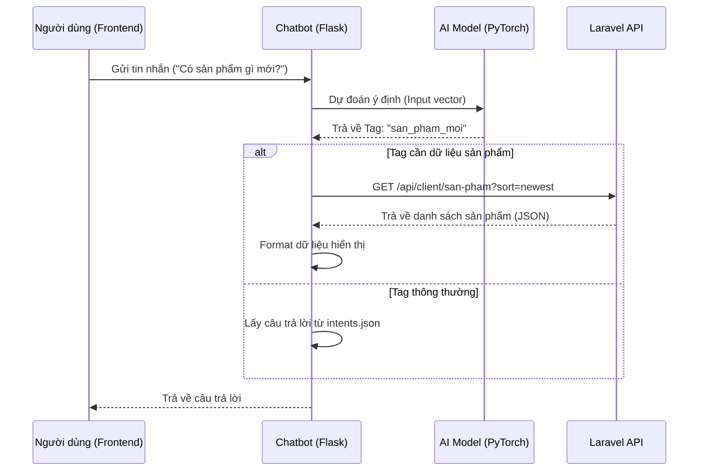

# Tài Liệu Chatbot Chợ Đồ Cũ

Tài liệu này mô tả chi tiết về cấu trúc, quy trình hoạt động và cách thức tích hợp dữ liệu của hệ thống Chatbot trong dự án Chợ Đồ Cũ.

## 1. Tổng Quan
Chatbot được xây dựng bằng **Python** sử dụng thư viện **PyTorch** cho mô hình Deep Learning (Neural Network) và **Flask** để cung cấp API. Chatbot có khả năng:
- Hiểu ý định người dùng (Intents) thông qua xử lý ngôn ngữ tự nhiên (NLP).
- Phản hồi các câu hỏi thường gặp (FAQ).
- **Tích hợp dữ liệu thời gian thực**: Gọi API sang Backend (Laravel) để lấy danh sách sản phẩm mới, sản phẩm theo giá, v.v.

## 2. Cấu Trúc Thư Mục & Công Dụng Các File

| Tên File/Thư Mục | Công Dụng |
|------------------|-----------|
| `app.py` | **File chính**. Chạy server Flask, cung cấp API `/chat`. Xử lý logic nhận tin nhắn, dự đoán ý định và gọi API Laravel để lấy dữ liệu sản phẩm nếu cần. |
| `train.py` | **File huấn luyện**. Đọc dữ liệu từ `intents.json`, xử lý ngôn ngữ, huấn luyện mô hình Neural Network và lưu kết quả vào `data.pth`. |
| `chat.py` | File chạy chatbot trên màn hình console (CMD) để test nhanh mà không cần chạy server API. |
| `model.py` | Định nghĩa kiến trúc mạng nơ-ron (Neural Network) với 3 lớp (Input -> Hidden -> Output). |
| `nltk_utils.py` | Chứa các hàm tiện ích xử lý ngôn ngữ tự nhiên: `tokenize` (tách từ), `stem` (đưa về từ gốc), `bag_of_words` (tạo vector đặc trưng). |
| `intents.json` | **Dữ liệu huấn luyện**. Chứa các mẫu câu (patterns) và câu trả lời (responses) được phân loại theo nhãn (tags). |
| `data.pth` | File chứa model đã được huấn luyện (weights) và bộ từ vựng. File này được tạo ra sau khi chạy `train.py`. |
| `requirements.txt` | Danh sách các thư viện Python cần thiết (torch, flask, nltk, v.v.). |
| `start.bat` | Script tự động trên Windows: tạo môi trường ảo, cài thư viện, huấn luyện model (nếu chưa có) và khởi động server. |

## 3. Quy Trình Lấy Dữ Liệu & Tích Hợp

Quy trình hoạt động của Chatbot được chia làm 2 giai đoạn: **Huấn Luyện (Training)** và **Chạy Thực Tế (Runtime)**.

### 3.1. Giai Đoạn Huấn Luyện (`train.py`)
1.  **Load Data**: Đọc file `intents.json`.
2.  **NLP Preprocessing**:
    *   Tách từ (Tokenize).
    *   Đưa về dạng gốc (Stemming).
    *   Tạo bộ từ điển (Vocabulary).
3.  **Vectorization**: Chuyển đổi câu văn thành các vector số (Bag of Words).
4.  **Training**: Đưa dữ liệu vào mạng Neural Network để học cách phân loại câu hỏi vào các `tag` (nhãn) tương ứng.
5.  **Save**: Lưu model đã học vào file `data.pth`.

### 3.2. Giai Đoạn Chạy Thực Tế & Tích Hợp (`app.py`)

Khi người dùng gửi tin nhắn, quy trình xử lý như sau:

1.  **Nhận Request**: API `/chat` nhận tin nhắn từ Frontend.
2.  **Dự Đoán (Prediction)**:
    *   Load model từ `data.pth`.
    *   Xử lý tin nhắn (Tokenize -> Stem -> Bag of Words).
    *   Model dự đoán `tag` (ý định) của câu nói (ví dụ: `san_pham_moi`, `chao_hoi`, `mua_hang`).
3.  **Xử Lý Phản Hồi (Response Logic)**:
    *   **Trường hợp 1: Câu hỏi thông thường (FAQ)**
        *   Nếu tag là `chao_hoi`, `mua_hang`,... -> Lấy ngẫu nhiên một câu trả lời từ `intents.json` và trả về.
    *   **Trường hợp 2: Cần dữ liệu sản phẩm (Integration)**
        *   Nếu tag là `san_pham_moi`, `san_pham_theo_gia`, `san_pham_lien_quan`...
        *   Chatbot sẽ gọi hàm `fetch_products()`.
        *   Hàm này gửi HTTP GET request sang **Laravel API** (`http://172.25.15.135:8000/api/client/san-pham`).
        *   Dữ liệu JSON trả về từ Laravel sẽ được Chatbot format lại thành tin nhắn văn bản hoặc cấu trúc JSON kèm link ảnh/sản phẩm.
4.  **Trả Response**: Trả kết quả về cho Frontend hiển thị.

### Sơ đồ luồng dữ liệu:


## 4. Chi Tiết Các Hàm Quan Trọng (trong `app.py`)

*   **`fetch_products(sort, per_page, keyword, ...)`**:
    *   Hàm này chịu trách nhiệm giao tiếp với Backend Laravel.
    *   Nó xây dựng các tham số (params) và gọi `requests.get()`.
*   **`format_product_message(products, title)`**:
    *   Chuyển đổi dữ liệu JSON thô từ Laravel thành tin nhắn thân thiện với người dùng.
    *   Tạo các link trỏ về trang chi tiết sản phẩm trên Frontend (`http://172.25.15.135:5173/san-pham/{id}`).
*   **`chat()`**:
    *   Endpoint chính xử lý mọi tin nhắn.
    *   Chứa logic điều hướng: khi nào thì trả lời text thường, khi nào thì gọi API lấy sản phẩm.

## 5. Cách Thêm Dữ Liệu Mới

Để dạy Chatbot hiểu thêm các câu hỏi mới:
1.  Mở file `intents.json`.
2.  Thêm một object mới vào mảng `intents` hoặc bổ sung vào `patterns` của tag có sẵn.
    ```json
    {
      "tag": "chu_de_moi",
      "patterns": ["câu hỏi 1", "câu hỏi 2"],
      "responses": ["Câu trả lời 1", "Câu trả lời 2"]
    }
    ```
3.  Chạy lại file `train.py` (hoặc chạy `start.bat` nếu file `data.pth` bị xóa) để huấn luyện lại model.
4.  Khởi động lại server `app.py`.
